# Cloud Employee Management App

A simple Flask employee app that I used to practice Docker, GitLab CI/CD, AWS, and ECS deployment.

The app lets you add, view, edit, and delete employees. It is deployed with GitLab CI/CD using Docker, Amazon ECR, Amazon ECS, AWS OIDC, and PostgreSQL on Amazon RDS.

## Project Overview

This project shows the full DevOps flow from code change to deployment:

```text
Developer
   |
   | git push / merge request
   v
GitLab Repository
   |
   v
GitLab CI/CD
   |
   +--> Pytest
   |
   +--> Pylint
   |
   +--> Docker Build
            |
            v
       Amazon ECR
            |
            v
   ECS Task Definition
            |
            v
       ECS Service
            |
            v
      Flask Application
            |
            v
     PostgreSQL / RDS
```

GitLab connects to AWS with OIDC, so I do not need to store permanent AWS access keys in GitLab.

## Application Features

The app can:

- Employee directory
- View employee records
- Add employees
- Edit employees
- Delete employees
- PostgreSQL-backed persistence
- Flask health-check endpoint
- Dockerized application runtime
- Automated CI/CD deployment to AWS ECS

Employee records include:

- Full name
- Job title
- Department
- Email
- Location

## Tech Stack

### Application

- Python
- Flask
- Flask-SQLAlchemy
- Flask-WTF
- SQLAlchemy
- HTML / CSS
- PostgreSQL

### DevOps

- Git
- GitLab
- GitLab CI/CD
- Docker
- Pytest
- Pylint
- jq

### AWS

- Amazon ECR
- Amazon ECS
- AWS Fargate
- Amazon RDS for PostgreSQL
- AWS IAM
- AWS STS
- OpenID Connect (OIDC)

## Repository Structure

```text
Employees_App/
|
├── app/
│   ├── static/
│   │   └── style.css
│   ├── templates/
│   ├── __init__.py
│   ├── config.py
│   ├── forms.py
│   ├── models.py
│   └── routes.py
|
├── Docker/
│   └── Dockerfile
|
├── docs/
│   └── screenshots/
|
├── tests/
│   └── test_app.py
|
├── .gitlab-ci.yml
├── .pylintrc
├── requirements.txt
├── run.py
└── README.md
```

## Running the Application Locally

Create a virtual environment:

```bash
python -m venv venv
```

Activate it.

Linux/macOS:

```bash
source venv/bin/activate
```

Windows:

```powershell
venv\Scripts\activate
```

Install dependencies:

```bash
pip install -r requirements.txt
```

Run the application:

```bash
python run.py
```

Open:

```text
http://localhost:5000
```

Health check:

```text
http://localhost:5000/health
```

## Environment Variables

The app uses environment variables for configuration.

Typical variables include:

```text
SECRET_KEY
DATABASE_URL
```

For production, `DATABASE_URL` can point to the PostgreSQL database running on Amazon RDS.

Example format:

```text
postgresql://dbadmin:<password>@<rds-endpoint>:5432/employees
```

Production secrets and database credentials should not be committed to the repository.

## Docker

The application is containerized with Docker.

Dockerfile:

```text
Docker/Dockerfile
```

Build the image:

```bash
docker build -t employees-app -f Docker/Dockerfile .
```

Run the container:

```bash
docker run -d \
  --name employees-app \
  -p 5000:5000 \
  employees-app
```

## Testing and Code Quality

The GitLab pipeline runs tests and code checks before deployment.

### Pytest

Run tests locally:

```bash
python -m pytest -v
```

### Pylint

Run static analysis locally:

```bash
pylint app/ tests/ run.py
```

These checks are also executed automatically in GitLab CI/CD.

## GitLab CI/CD Workflow

The pipeline uses three stages:

```text
test
build
deploy
```

The workflow changes depending on the branch.

### Feature Branch / Merge Request

For feature branch work, the pipeline runs application validation such as:

```text
pylint_job
pytest_job
```

This helps catch problems before the code is merged into `main`.

### Main Branch

After the code is merged into `main`, the pipeline builds and deploys the app:

```text
build_docker
deploy_job
```

The Docker image is built, pushed to Amazon ECR, and then deployed to Amazon ECS.

## AWS Authentication with GitLab OIDC

The pipeline uses GitLab OIDC instead of permanent AWS credentials.

High-level authentication flow:

```text
GitLab CI Job
      |
      | OIDC token
      v
AWS STS
      |
      | AssumeRoleWithWebIdentity
      v
AWS IAM Role
      |
      v
Temporary AWS credentials
```

This means I do not need to save permanent keys such as:

```text
AWS_ACCESS_KEY_ID
AWS_SECRET_ACCESS_KEY
```

inside GitLab CI/CD.

## Docker Image Versioning

Docker images are tagged using the Git commit short SHA.

Example image structure:

```text
AWS_ACCOUNT_ID.dkr.ecr.REGION.amazonaws.com/REPOSITORY:CI_COMMIT_SHORT_SHA
```

Example:

```text
123456789012.dkr.ecr.us-east-1.amazonaws.com/project/my-app:54024abd
```

Using the commit SHA makes it easy to see which Git commit created each Docker image.

## Amazon ECR

Amazon ECR stores the Docker images created by the GitLab pipeline.

The build stage performs the following:

1. Authenticates to AWS using OIDC.
2. Authenticates Docker to Amazon ECR.
3. Builds the application image.
4. Tags the image with the Git commit short SHA.
5. Pushes the image to ECR.

The ECR repository keeps different image versions, each tied to a Git commit.

## Amazon ECS Deployment

The app runs on Amazon ECS using Fargate.

The deployment job:

1. Retrieves the current ECS task definition.
2. Saves the task definition as JSON.
3. Uses `jq` to replace the container image with the new ECR image.
4. Removes ECS-generated read-only fields.
5. Registers a new task definition revision.
6. Captures the new task definition ARN.
7. Updates the ECS service to use the new revision.

## Updating the ECS Task Definition with jq

The current task definition is retrieved with the AWS CLI:

```bash
aws ecs describe-task-definition \
  --task-definition "${TASK_DEFINITION_NAME}" \
  --region "${REGION}" \
  --output json > current_task_definition.json
```

`jq` is then used to update the image while preserving the rest of the task definition:

```bash
jq --arg IMAGE "${IMAGE_URI}" \
  '.taskDefinition
  | .containerDefinitions[0].image = $IMAGE
  | del(
      .taskDefinitionArn,
      .revision,
      .status,
      .requiresAttributes,
      .compatibilities,
      .registeredAt,
      .registeredBy
    )' \
  current_task_definition.json > new_task_definition.json
```

The key image update is:

```text
.containerDefinitions[0].image = $IMAGE
```

The new revision is registered:

```bash
aws ecs register-task-definition \
  --cli-input-json file://new_task_definition.json
```

The ECS service is then updated to use the newly registered task definition revision.

This lets the pipeline deploy a new version without me editing the ECS task definition by hand.

## PostgreSQL on Amazon RDS

The deployed app uses PostgreSQL to store employee data.

The database stores the employee records used by the Flask application, including:

```text
id
full_name
job_title
department
email
location
```

The screenshot below shows the employee data directly from PostgreSQL.

## How I Check the Deployment

I check these things to make sure a deployment worked:

- GitLab pipeline status
- Successful test jobs
- Successful Docker build
- Image presence in ECR
- New ECS task definition revision
- New ECS tasks becoming active
- Application availability after deployment
- PostgreSQL data persistence

## Screenshots

These screenshots show the app, the GitLab pipeline, the AWS deployment, and the database.

### Application

#### Home Page After MR

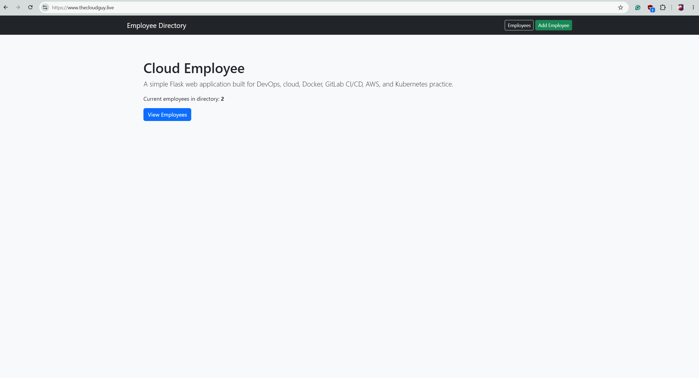

#### Employees Directory

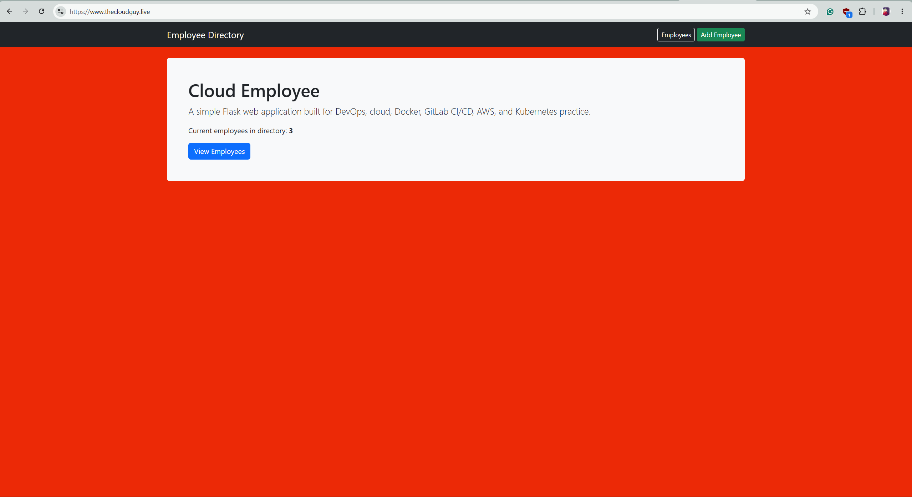

#### Edit Employee

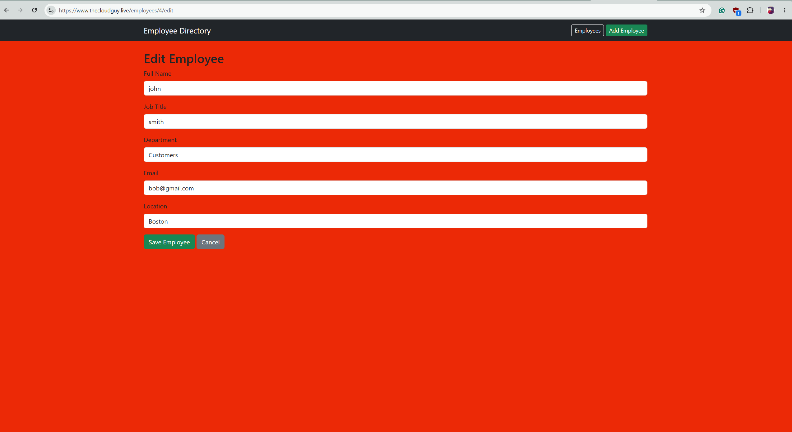

#### Delete Employee

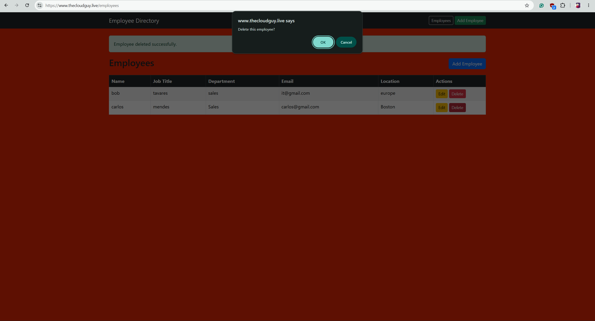

### GitLab CI/CD

#### Pipelines Overview

This shows successful pipeline runs.

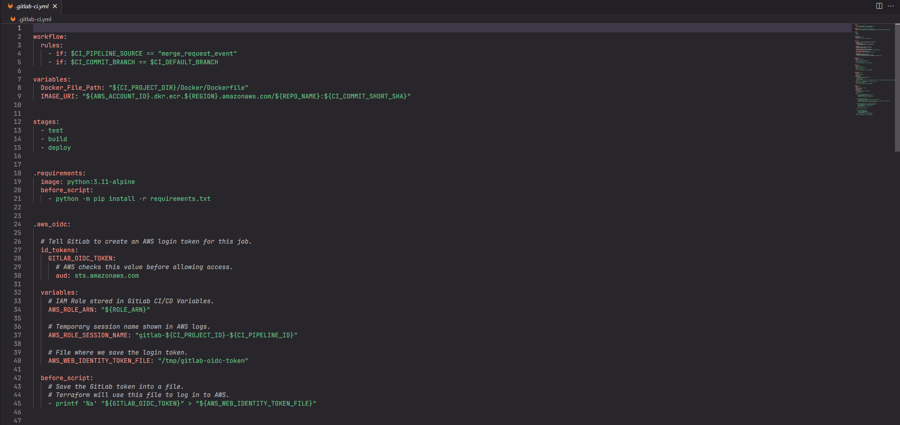

#### Test Jobs

On the feature branch, Pylint and Pytest run before the code is merged.

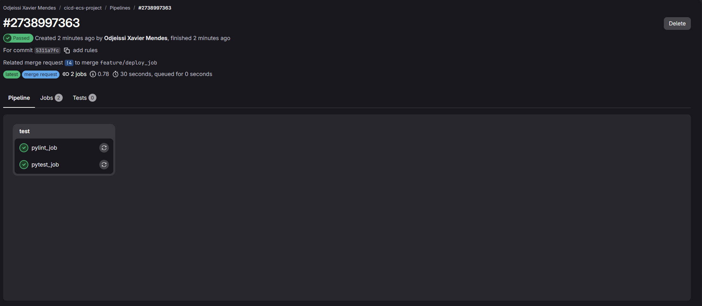

#### Build and Deploy

After the merge to `main`, the pipeline builds the Docker image and deploys it to ECS.

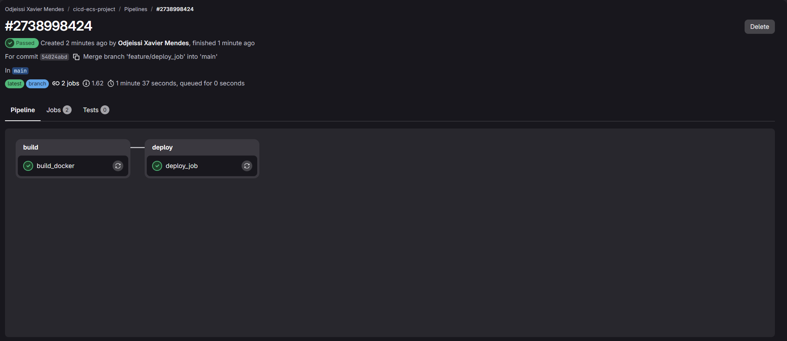

### Amazon ECR

This shows Docker images in ECR, tagged with Git commit IDs.

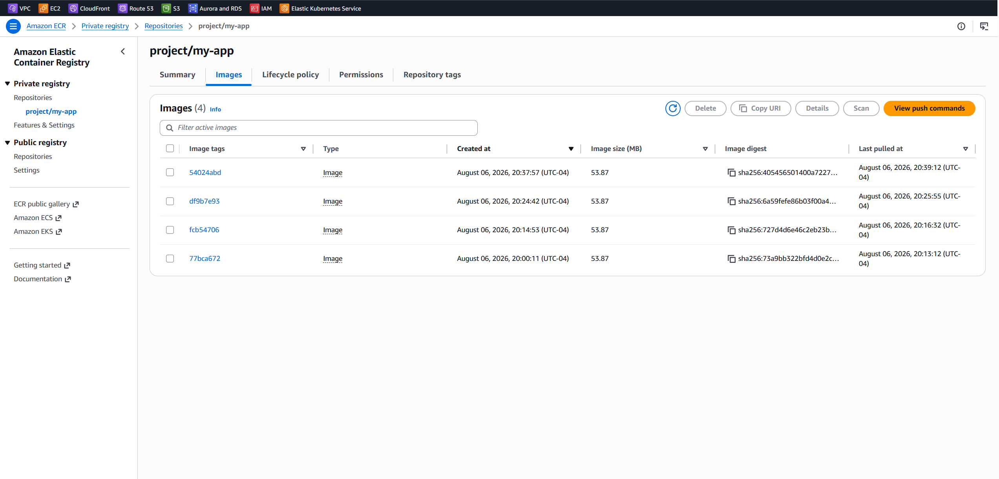

### Amazon ECS

#### ECS Cluster Tasks

This shows the app tasks running in ECS Fargate.

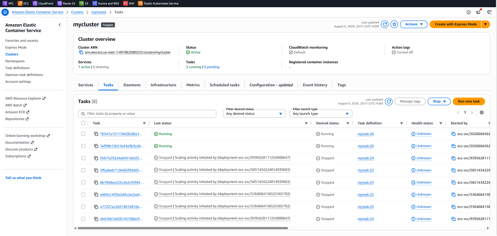

#### New Task Revision After Deployment

A new deployment starts new ECS tasks with a newer task definition revision.

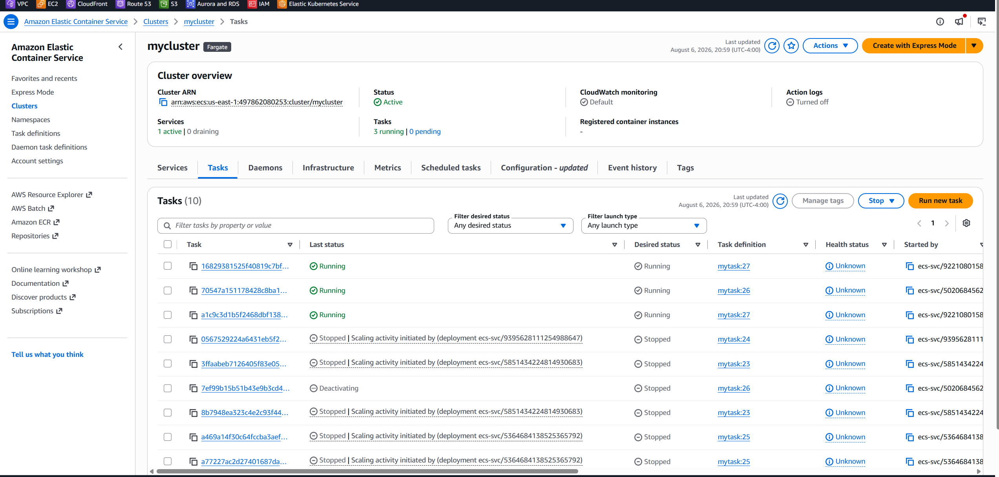

### PostgreSQL Database

This shows the employee records stored in PostgreSQL.

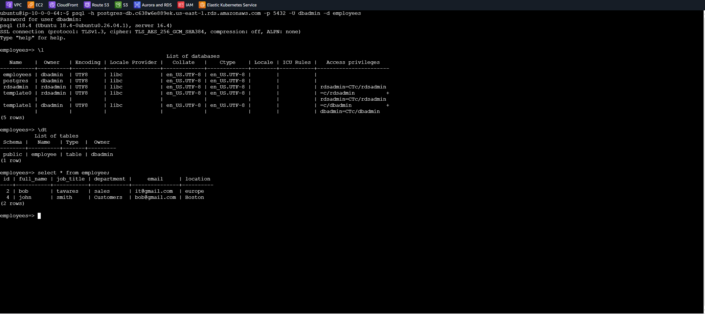

### Live Application After Deployment

The running application can be reached at:

```text
https://www.thecloudguy.live
```

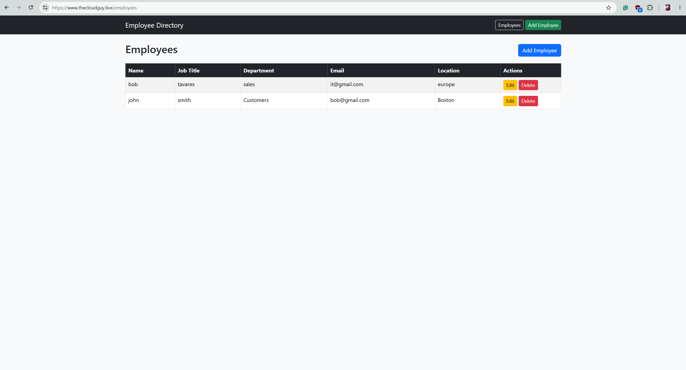

## CI/CD Test Example

One of the deployment tests changed the application background color in a feature branch.

The workflow demonstrated:

```text
Feature Branch
      |
      v
Code Change
      |
      v
Merge Request
      |
      v
Tests Pass
      |
      v
Merge to Main
      |
      v
Docker Image Built
      |
      v
Image Pushed to ECR
      |
      v
New ECS Task Revision
      |
      v
ECS Service Deployment
      |
      v
Updated Application Visible
```

This test shows that a code change can go from Git, through the pipeline, into a new Docker image, then into ECS, and finally show up in the live app.

## What I Learned

What I practiced in this project:

- Building and organizing a Flask application
- Working with SQLAlchemy and PostgreSQL
- Containerizing Python applications with Docker
- Writing automated tests with Pytest
- Running code-quality checks with Pylint
- Building GitLab CI/CD pipelines
- Using feature branches and merge requests
- Separating validation from production deployment
- Authenticating GitLab to AWS using OIDC
- Assuming AWS IAM roles with temporary credentials
- Building and pushing Docker images to Amazon ECR
- Tagging images with Git commit SHAs
- Deploying containers with Amazon ECS and Fargate
- Understanding ECS task definitions and revisions
- Manipulating JSON with `jq`
- Registering new ECS task definition revisions automatically
- Updating ECS services from CI/CD
- Connecting a Flask application to PostgreSQL on Amazon RDS
- Verifying deployments across GitLab, ECR, ECS, and the application

## Why I Built This Project

I built this repository as a DevOps learning project.

The main goal was to practice the full process: test the app, build a Docker image, push it to AWS, deploy it to ECS, and confirm that the new version is running.
